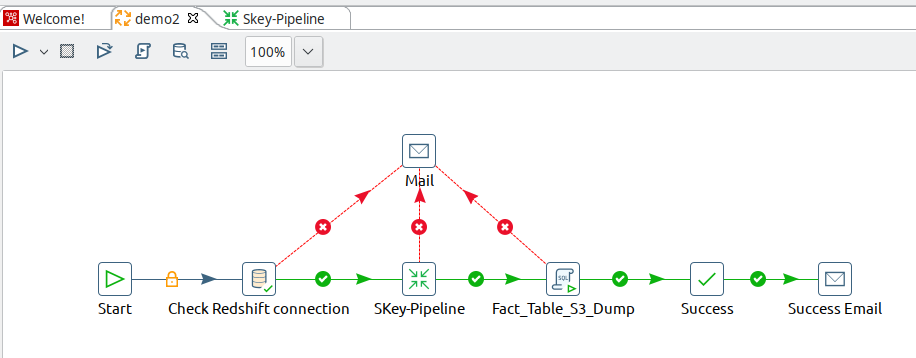
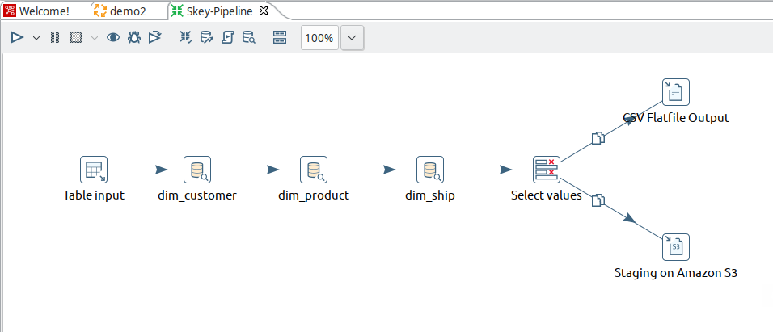
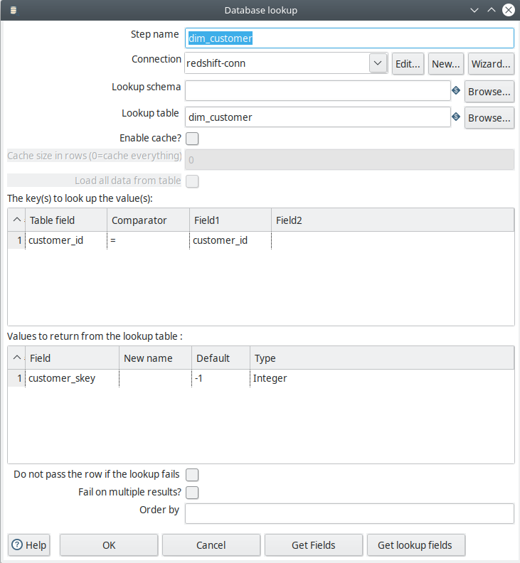
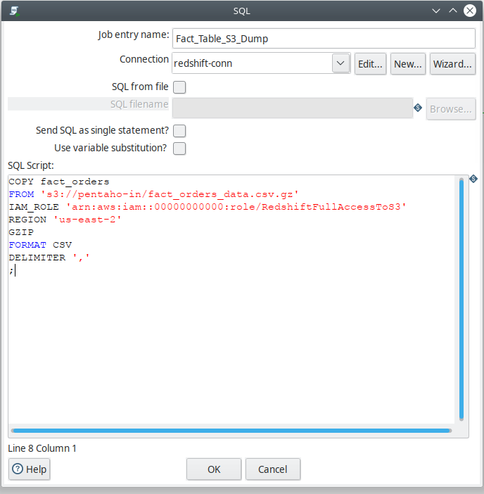

# Redshift ETL using PDI

Showing multiple ETL jobs that implement data warehousing techniques using Pentaho Kettle and Amazon Redshift.

## Tools

- Pentaho Data Integration connected to Amazon Redshift using JDBC driver.
- Up & running Redshift cluster, basic configuration (2 dense-compute nodes).
- Proper Amazon IAM roles to allow Redshift access S3 buckets.

The following are some of the best Redshift data loading best-practices that have been followed in these tasks:

- Loading data in bulk:
  Using Amazon S3 to stage & accumulate data (could be from multiple sources) before executing a bulk `COPY` operation. Staging data on S3 allows using some Redshift features such as _manifest file_.
- Compressing data files:
  Compressing data (e.g. in GZIP) reduces `COPY` command processing time and further improves Redshift cluster performance.

There are multiple techniques that enhance ETL performance on Redshift depending on the complexity of the job.

## 1. Basic ETL

The goal of this ETL job is to demonstrate basic data extraction from multiple dimensional tables hosted locally on a MySQL database and loading these tables into Amazon Redshift using Pentaho Data Integration (PDI). Both MySQL and Redshift tables have the same schema, so this is not an OLTP to Data Warehouse CDC or Pipeline, it is merely basic dimensional-table to dimensional-table mapping to examine the best way to move data from local database to Amazon Redshift.

The following screenshot summarizes the entire ETL job:

1. First step: To check Redshift JDBC connection.
2. Second step: to extract MySQL tables in staging them into S3 bucket, as per the following screenshot:
   
3. Third step: executing Redshift DDL statements to create the required table with the proper sort and distribution keys:
   
4. Now the tables are ready and data waiting in our S3 bucket, in this step we are going to load the data form S3 to Redshift tables:
   

5. Finally, adding two email notifications, one for success & another for failure.

The total number of records is small (around 2.5 million) so it took around ~40 seconds to process the entire job.

---

## 2. Surrogate Key Pipeline

This ETL job shows three dimensional tables surrogate-keys pipeline while loading the fact table in Amazon Redshift.

1. First step: To check Redshift JDBC connection.
2. Second Step: Execute pipeline task. The following screenshot provides a detailed view into this task:

- `Table input` is the data source from OLTP table hosted locally on MySQL database.
- `dim_customer` step is to transition the surrogate key of the customer dimensional table according to the OLTP natural key using the following mapping between the natural keys and default value of (-1) in case of missing a natural key:
  
- `Select values` step is to remove the attributes that are not found or required in our fact table schema:
- The final step is staging the data on Amazon S3 bucket as well as creating a CSV copy in the local machine.

1. The final step in the ETL job is to load the data from S3 bucket to Redshift fact table
   
