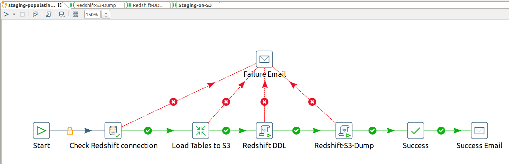
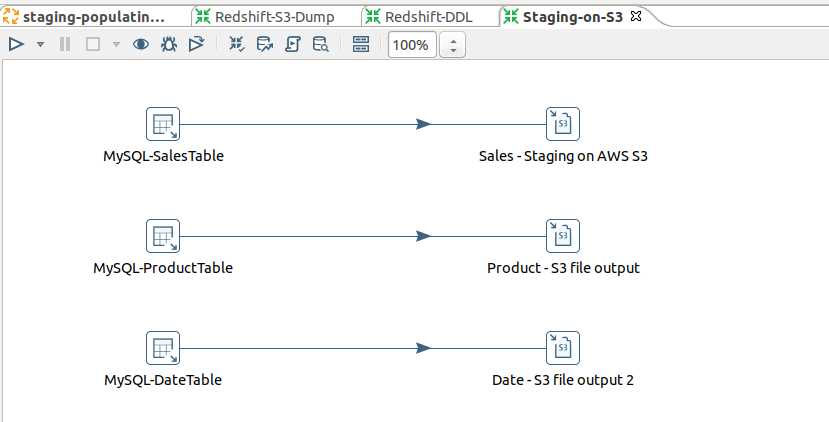
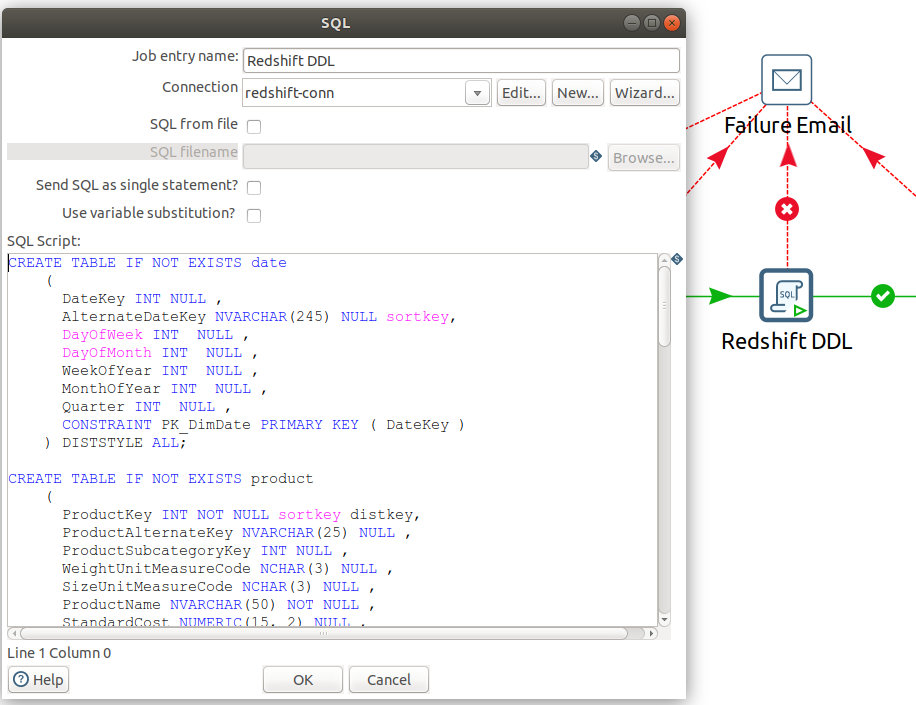
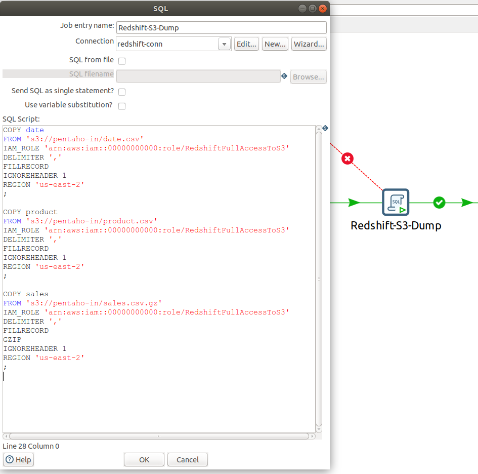

# Redshift ETL using PDI

After configuring PDI JDBC connection

# ETL Essentials

## Objective

The goal of this ETL job is to demonstrate basic data extraction from multiple dimensional tables hosted locally on a MySQL database and loading these tables into Amazon Redshift using Pentaho Data Integration (PDI).

## Method

Both MySQL and Redshift tables have the same schema, so this is not an OLTP to Data Warehouse CDC or Pipeline, it is merely basic dimensional-table to dimensional-table mapping to examine the best way to move data from local database to Amazon Redshift. Assuming that Redshift dimensional tables are empty and never been populated, we are going to extract the data from MySQL database, compressing the data using GZIP codec, staging the data in Amazon S3 bucket, and then pulling the compressed data from S3 bucket into Redshift tables.

The following are some of the best Redshift data loading practices that have been followed in this demo:

- Loading data in bulk:
  Using Amazon S3 to stage & accumulate data (could be from multiple sources) before executing a bulk `COPY` operation. Staging on S3 also allow us to use some of Redshift features such as _manifest file_.
- Compressing data files:
  Compressing data (e.g. in GZIP) reduces `COPY` command time and further improves Redshift cluster performance.

There are multiple techniques that enhance ETL jobs performance on Redshift depending on the complexity of the job.

## ETL Job

The following screenshot summarizes the entire ETL job

1. First step: To check Redshift JDBC connection.
2. Second step: to extract MySQL tables in staging them into S3 bucket, as per the following screenshot:
   
3. Third step: executing Redshift DDL statements to create the required table with the proper sort and distribution keys:
   
4. Now the tables are ready and data waiting in our S3 bucket, in this step we are going to load the data form S3 to Redshift tables:
   

5. Finally, adding two email notifications, one for success & another for failure.
